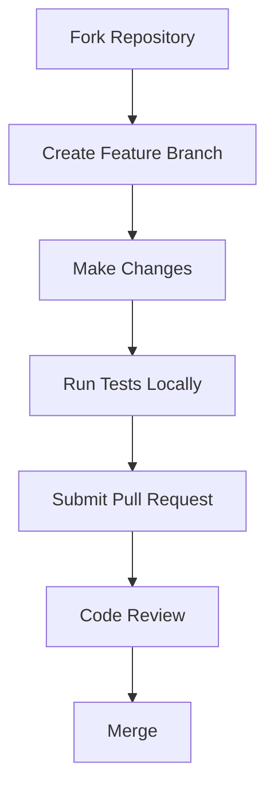

# 🤝 Contributing to RapidKit

Welcome to RapidKit! We're excited to have you contribute to our enterprise-grade development
platform. This guide will help you get started with contributing effectively.

## 🎯 Quick Start

### For New Contributors

1. **📚 Read the docs**: Start with the [Developer Guide](../developer-guide/) and
   [Getting Started](../getting-started/).
1. **🔧 Set up your environment**: Follow the [Getting Started guide](../getting-started/).
1. **💡 Find an issue**: Check [GitHub Issues](https://github.com/getrapidkit/core/issues) for “good
   first issue”.
1. **🚀 Make changes**: Follow the development workflow below.

______________________________________________________________________

## 🔄 Development Workflow

### Standard Contribution Process



### Step-by-Step Guide

#### 1. Fork & Clone

```bash
# Fork the repository on GitHub
# Then clone your fork
git clone https://github.com/YOUR_USERNAME/core.git
cd core
```

#### 2. Create Feature Branch

```bash
# Create a descriptive branch name
git checkout -b feature/add-new-module
# or for bug fixes
git checkout -b fix/issue-123-description
```

#### 3. Make Changes

```bash
# Follow our coding standards
# Add tests for new functionality
# Update documentation as needed
```

#### 4. Test Your Changes

```bash
# Run the full test suite
pytest tests/ -v --cov=src/

# Run linting and type checking
ruff check src/
mypy src/

# Run security checks
bandit -r src/
```

#### 5. Commit & Push

```bash
# Stage your changes
git add .

# Commit with descriptive message
git commit -m "feat: add authentication module with OAuth2 support

- Implement OAuth2 flow for user authentication
- Add JWT token management
- Include comprehensive test coverage
- Update API documentation"

# Push to your fork
git push origin feature/add-new-module
```

#### 6. Create Pull Request

- Go to the original repository on GitHub
- Click "New pull request"
- Select your feature branch
- Fill out the [pull request template](PULL_REQUEST_TEMPLATE.md)
- Submit for review

______________________________________________________________________

## 📋 Contribution Guidelines

### Code Quality Standards

#### Python Code

- **PEP 8**: Follow Python style guidelines
- **Type Hints**: Use type annotations for all functions
- **Docstrings**: Document all public functions and classes
- **Imports**: Organize imports (stdlib, third-party, local)

#### Testing Requirements

- **Coverage**: Minimum 80% test coverage required
- **Unit Tests**: Test individual functions and methods
- **Integration Tests**: Test component interactions
- **E2E Tests**: Test complete user workflows

#### Security Standards

- **Dependency Scanning**: Run safety checks on dependencies
- **Secrets Management**: Never commit secrets or keys
- **Input Validation**: Validate all user inputs
- **Authentication**: Secure all authenticated endpoints

### Commit Message Format

We follow conventional commits for consistency:

```text
type(scope): description

[optional body]

[optional footer]
```

**Types:**

- `feat`: New feature or functionality
- `fix`: Bug fix
- `docs`: Documentation changes
- `style`: Code style/formatting changes
- `refactor`: Code refactoring (no functional changes)
- `test`: Adding or updating tests
- `chore`: Maintenance tasks, build changes
- `debug`: Debug/testing changes

**Examples:**

```bash
feat(auth): add OAuth2 authentication support
fix(api): resolve memory leak in request handler
docs(readme): update installation instructions
test(utils): add unit tests for string helpers
```

### Branch Naming Convention

- **Features**: `feature/description-of-feature`
- **Bug Fixes**: `fix/issue-number-description`
- **Documentation**: `docs/update-description`
- **Hotfixes**: `hotfix/critical-issue-description`

______________________________________________________________________

## 🏗️ Architecture-Specific Contributions

### Core Engine Contributions

For changes to the core engine (`community`):

1. **Impact Assessment**: Evaluate impact on all distribution tiers
1. **Backward Compatibility**: Ensure no breaking changes without migration path
1. **Testing**: Comprehensive testing across all supported platforms
1. **Documentation**: Update architecture docs and API references

### Commercial Feature Contributions

#### Direct Repository Contribution (Recommended)

```bash
# For pro features
git clone https://github.com/getrapidkit/community.git
cd pro
git checkout -b feature/commercial-feature
```

#### Engine-First Contribution

```bash
# Start with core engine
git clone https://github.com/getrapidkit/core.git
cd core
git checkout -b feature/engine-enhancement

# After merge, changes sync to commercial repos automatically
```

______________________________________________________________________

## 🔄 Repository Synchronization

### Automatic Sync Process

RapidKit uses automated workflows to sync changes between repositories:

```yaml
# .github/workflows/sync-distribution.yml
name: Sync Distribution
on:
    push:
        branches: [main]
jobs:
    sync:
        runs-on: ubuntu-latest
        steps:
            - name: Sync to Pro
              run: ./scripts/sync-to-pro.sh
            - name: Sync to Enterprise
              run: ./scripts/sync-to-enterprise.sh
```

### Manual Sync (When Needed)

```bash
# Force sync all repositories
gh workflow run sync-distribution.yml -R getrapidkit/core

# Or run sync script directly
./scripts/sync-distribution.sh
```

> ℹ️ New to the automation stack? Read the
> [GitHub Actions Overview](../developer-guide/github-actions-overview.md) for a diagram of every
> workflow plus the composite actions that power distribution and promotions.

### Workflow Deployment

Due to GitHub token permissions, CI/CD workflows deploy separately:

```bash
# Deploy workflows to all repositories
export GITHUB_TOKEN=your_workflow_token_here
./scripts/deploy-workflows.sh

# Verify deployment
gh workflow list -R getrapidkit/core
```

______________________________________________________________________

## 🧪 Testing Strategy

### Test Categories

#### Unit Tests

```bash
# Run specific test file
pytest tests/test_module.py -v

# Run with coverage
pytest tests/ --cov=src/ --cov-report=html
```

#### Integration Tests

```bash
# Test component interactions
pytest tests/integration/ -v

# Test with external services
pytest tests/integration/ --runslow
```

#### End-to-End Tests

```bash
# Full workflow testing
pytest tests/e2e/ -v

# Test with real data
pytest tests/e2e/ --real-data
```

### Quality Gates

- **Code Coverage**: ≥80% overall, ≥90% for critical paths
- **Linting**: Zero errors from ruff, mypy
- **Security**: Zero high/critical vulnerabilities
- **Performance**: No regression in benchmark tests

______________________________________________________________________

## 🎖️ Recognition & Rewards

### Contributor Benefits

- **📊 Recognition**: Listed in repository contributors and release notes
- **🏆 Achievements**: Earn contributor badges and certificates
- **💰 Rewards**: Eligible for bounties on complex features
- **📜 Acknowledgments**: Featured in documentation and newsletters

### Contribution Levels

- **🥉 Contributor**: First merged PR
- **🥈 Regular Contributor**: 5+ merged PRs
- **🥇 Core Contributor**: 25+ merged PRs, review permissions
- **👑 Maintainer**: Commit access, release management

______________________________________________________________________

## 📞 Getting Help

### Communication Channels

- **🐛 Bug Reports**: [GitHub Issues](https://github.com/getrapidkit/core/issues)
- **💡 Feature Requests**: [GitHub Discussions](https://github.com/getrapidkit/core/discussions)
- **💬 General Discussion**: [Discord Community](https://discord.gg/rapidkit)
- **📧 Enterprise Support**: [enterprise@rapidkit.com](mailto:enterprise@rapidkit.com)

### Documentation Resources

- **[🏗️ Module Architecture](../modules/architecture/)**: Module system design and contracts
- **[🛠️ Developer Guide](../developer-guide/)**: Development best practices
- **[📚 API Reference](../api-reference/)**: Complete API documentation
- **[🚀 Getting Started](../getting-started/)**: Quick start tutorials

______________________________________________________________________

## 📜 Code of Conduct

We are committed to providing a welcoming and inclusive environment for all contributors. Please:

- **🤝 Be Respectful**: Treat all contributors with respect and kindness
- **🎯 Stay Focused**: Keep discussions relevant to the project goals
- **🔍 Be Constructive**: Provide helpful feedback and suggestions
- **📖 Follow Guidelines**: Adhere to our contribution and coding standards

Violations of our code of conduct may result in temporary or permanent exclusion from the community.

______________________________________________________________________

## 📜 License

By contributing to RapidKit, you agree that your contributions will be licensed under the same
license as the project (MIT for core, commercial licenses for pro/enterprise).

Thank you for contributing to RapidKit! 🚀
